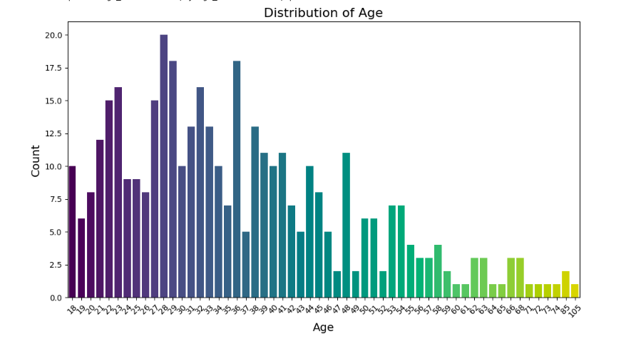

# Loan Prediction Model API

This project exposes a trained machine learning model through a simple API built using Flask. The model predicts whether a loan applicant will repay the loan or default, based on the provided user features.

## Project Overview

The API is designed to take user data (e.g., age, cash incoming, GPS location data) and return a prediction of whether the user will repay the loan or default. The model was trained using a **Random Forest Classifier** on historical loan data.

## Requirements

To run the project, the following dependencies are required:

- **Python 3.x**
- **Flask**: Web framework to create the API.
- **joblib**: For loading the saved machine learning model.
- **pandas**: For data handling and manipulation.
- **scikit-learn**: For machine learning model training and evaluation.
- **seaborn**, **matplotlib**: For visualizations (optional, for analysis).

### Data Visualization

### Distribution of Age

### Average Cash Incoming (30 Days) by Age

### Map of loan_outcomes by location 

